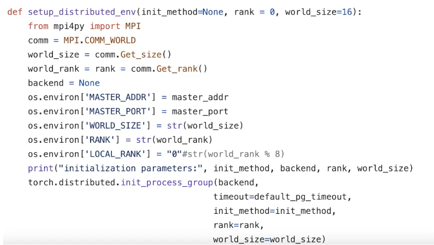

# pytorch_on_frontier
A basic guide for setting up and running PyTorch on Frontier

There is some terminology that will be important to understanding how Pytorch can be run on Frontier before we go through the examples. This comes from undertanding the architecture of the AMD GPUs, the definitions of the Environment Variables and some tips for setting up the conda environment.

## AMD GPU

The AMD Instinct MI200 is built on advanced packaging technologies enabling two Graphic Compute Dies (GCDs) to be integrated into a single package in the Open Compute Project (OCP) Accelerator Module (OAM) in the MI250 and MI250X products. Each GCD is build on the AMD CDNA 2 architecture. A `single Frontier node` contains 4 MI250X OAMs for the total of `8 GCDs`.

<span style="color: #ADD8E6;">Note: The Slurm workload manager and the ROCr runtime treat each GCD as a separate GPU and visibility can be controlled using the `ROCR_VISIBLE_DEVICES` environment variable. Therefore, from this point on, the Frontier guide simply refers to a GCD as a GPU.</span>

## Pytorch Env Variables

`ROCR_VISIBLE_DEVICES`: controls visibility of the GPUs through the Slurm workload manager.

`WORLD_SIZE`: This variable represents the total number of processes participating in the job. It is essential for distributed training as it helps PyTorch understand the scale of the job.

`RANK`: This is the global rank of the current process. Each process in the distributed job is assigned a unique rank, starting from 0 up to `WORLD_SIZE -1`. The rank is used to identify each process uniquely.

`LOCAL_RANK`: This variable indicates the rank of the process on the local node. It is particularly useful when multiple processes are running on the same node, helping to distinguish between them.

`MASTER_ADDR`: This is the IP address of the master node, which coordinates the distributed training. All processes need to know this address to communicate with the master node.

`MASTER_PORT`: This is the port on the master node that will be used for communication. It should be a free port that all processes can use to connect to the master node.

`NCCL_SOCKET_IFNAME`: This variable specifies the network interface to be used by NCCL (NVIDIA Collective Communications Library) for communication. Setting this can hep optimize network performance by choosing the appropriate network interface.

These are a few environment variables that are crucial for setting up and managing distributed training in Pytorch, ensuring that all processes can communicate effictively and work together. 

For further information check out the documentation: [PyTorch Distributed Training Documentation](https://pytorch.org/tutorials/intermediate/dist_tuto.html)

## Basics of running PyTorch on Frontier

<br>
Please avoid using torchrun. It is recommended to use srun to handle the task mapping instead. On Frontier, the use of torchrun significantly impacts the performance of your code. Initial tests have shown that a script which normally runs on order of 10 seconds can take up to 10 minutes to run when using torchrun – over an order of magnitude worse! Additionally, nesting torchrun within srun (i.e., srun torchrun ...) does not help, as the two task managers will clash.
<br>

<br>
First to get started with how to run PyTorch on Frontier we need to load the modules and create/activate the conda environment to be used:

```bash
module load PrgEnv-gnu/8.5.0
module load miniforge3/23.11.0-0
module load rocm/6.0.0
module load craype-accel-amd-gfx90a
```


Then create the Conda Environment: 
```bash
conda create -p /path/to/my_env python=3.10
source activate /path/to/my_env
```

Once that is complete we can now install PyTorch: 
```bash
pip install torch==2.3.1 torchvision==0.18.1 torchaudio==2.3.1 --index-url https://download.pytorch.org/whl/rocm6.0
```
```bash
MPICC="cc -shared" pip install --no-cache-dir --no-binary=mpi4py mpi4py 

# isn’t required in general (you can accomplish the same task using system environment variables), it acts as a nice convenience when needing to set various MPI parameters when using PyTorch for distributed training. 
```

Clone the repository and move into the directory.
```bash
git clone https://github.com/jspe406/pytorch_on_frontier.git

cd pytorch_on_frontier
```

A simple NN running on one node to demonstrate the use of PyTorch tensors and PyTorch's NN model
```bash
# edit the file to add your Project_ID and path to env
sbatch --export=NONE pytorch_nn_job.sl
```

<span style="color: #ADD8E6;">Note: If you keep getting the `ModuleNotFoundError` it may be because the module was loaded twice in the environment. This causes a path issue which may be resolved by explicitly specifying the path to pyton in the batch script file.</span>

It is good practice to always specify the path regardless. The path can be found using:
```bash
echo "Python Environment Path: $(which python)"
```

The output and error files are both found in the `logs` directory
```bash
# Once the job runs succesfully the output file will show something like this

Epoch [1000/10000], Loss: 0.5720
Epoch [2000/10000], Loss: 0.3862
Epoch [3000/10000], Loss: 0.2706
Epoch [4000/10000], Loss: 0.2096
Epoch [5000/10000], Loss: 0.1731
Epoch [6000/10000], Loss: 0.1490
Epoch [7000/10000], Loss: 0.1320
Epoch [8000/10000], Loss: 0.1193
Epoch [9000/10000], Loss: 0.1095
Epoch [10000/10000], Loss: 0.1016
Accuracy: 99.10%
```

## Setup DDP on Frontier
In this example we are going to run our Distributed Data Parallel example using `pytorch_ddp_job.sl` and `pytorch_ddp.py`.

The following Environment Variables are required to run DDP:
- `MASTER_PORT` - required; has to be a free port on machine with rank 0

- `MASTER_ADDR` - required (except for rank 0); address of rank 0 node

- `WORLD_SIZE` - required; can be set either here, or in a call to init function

- `RANK` - required; can be set either here, or in a call to init function

<span style="color: #ADD8E6;">Note: `nccl` backend is currently the fastest and highly recommended when using GPUs. This applies to both single-node and multi-node distributed training.</span>

There are multiple ways to set up the environment variables one of which is within the python code. Check the `pytorch_ddp.py` file to see how the environment variables were initialized and used. To better understand why each one is important, read [Pytorch Env Variables](https://pytorch.org/docs/stable/distributed.html#environment-variable-initialization) 

Here is another an example function to set up the variables: 

<br>
<center>

</center>
<br>

```bash
# add your project id and path to `pytorch_ddp_job.sl`
# run the job
sbatch --export=NONE pytorch_ddp_job.sl
```

```bash
# Once it has completed running, a snippet from the output file should look similar to this:

[GPU13] Epoch 1 | Batchsize: 32 | Steps: 4
Epoch 0 | Training snapshot saved at snapshot.pt
[GPU2] Epoch 1 | Batchsize: 32 | Steps: 4
Epoch 0 | Training snapshot saved at snapshot.pt
Epoch 0 | Training snapshot saved at snapshot.pt
Epoch 0 | Training snapshot saved at snapshot.pt
[GPU15] Epoch 1 | Batchsize: 32 | Steps: 4
[GPU5] Epoch 1 | Batchsize: 32 | Steps: 4
Epoch 0 | Training snapshot saved at snapshot.pt
[GPU9] Epoch 1 | Batchsize: 32 | Steps: 4
Epoch 0 | Training snapshot saved at snapshot.pt
[GPU3] Epoch 1 | Batchsize: 32 | Steps: 4
Epoch 0 | Training snapshot saved at snapshot.pt
[GPU11] Epoch 1 | Batchsize: 32 | Steps: 4
[GPU1] Epoch 1 | Batchsize: 32 | Steps: 4
Epoch 0 | Training snapshot saved at snapshot.pt
Epoch 0 | Training snapshot saved at snapshot.pt
Epoch 0 | Training snapshot saved at snapshot.pt
Epoch 0 | Training snapshot saved at snapshot.pt
Epoch 0 | Training snapshot saved at snapshot.pt
Epoch 0 | Training snapshot saved at snapshot.pt
Epoch 0 | Training snapshot saved at snapshot.pt
Epoch 0 | Training snapshot saved at snapshot.pt
[GPU8] Epoch 1 | Batchsize: 32 | Steps: 4
[GPU0] Epoch 1 | Batchsize: 32 | Steps: 4
[GPU12] Epoch 1 | Batchsize: 32 | Steps: 4
[GPU7] Epoch 1 | Batchsize: 32 | Steps: 4
[GPU10] Epoch 1 | Batchsize: 32 | Steps: 4
[GPU6] Epoch 1 | Batchsize: 32 | Steps: 4
[GPU14] Epoch 1 | Batchsize: 32 | Steps: 4
[GPU4] Epoch 1 | Batchsize: 32 | Steps: 4
```
This is running Pytorch to train on two nodes, 16 GPUs for 2000 epochs and saves the training snapshot. If the script is run a second time it will pick up from the saved snapshot and continue training.

Here we can see for each GPU on the nodes (total of 16), one epoch was run. Here it is easier to visualize that the `GLOBAL RANK` or `RANK` is the number assiged to the GPU relative to the total GPUs across all nodes [0-15] and the `LOCAL RANK` would be relative to GPUs residing on a single node [0-7]

For further information or tips the following resources have been listed. If you would like to see more examples that have been run on frontier, the following [ai-training-series](https://github.com/olcf/ai-training-series/tree/main/ai_at_scale_part_2) is a great resource with code examples.

This video in the PyTorch documentation also explains and demonstrates the difference between the global and local ranks and how to run a multinode job using DDP [Multinode Training](https://pytorch.org/tutorials/intermediate/ddp_series_multinode.html)

## Resources:
[Pytorch Documentation](https://pytorch.org/docs/stable/index.html)

[PyTorch On Frontier - OLCF Docs](https://docs.olcf.ornl.gov/software/python/pytorch_frontier.html)

[Conda Basics - OLCF Docs](https://docs.olcf.ornl.gov/software/python/conda_basics.html)

[Conda - Best Practices - OLCF Docs](https://docs.olcf.ornl.gov/software/python/index.html#best-practices)

[Torch Environment Variables](https://pytorch.org/docs/stable/torch_environment_variables.html)

[Datacamp: Pytorch Tutorial](https://www.datacamp.com/tutorial/pytorch-tutorial-building-a-simple-neural-network-from-scratch)